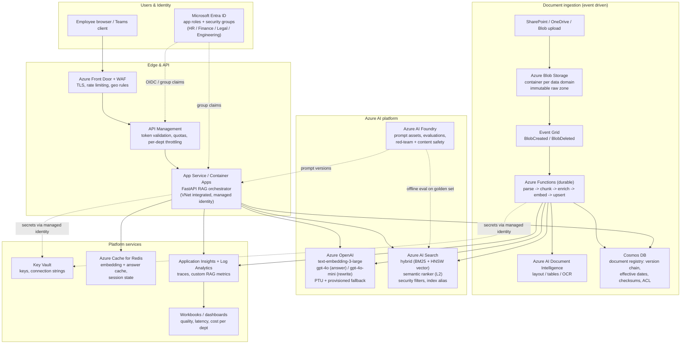

# Production Architecture — Enterprise Knowledge Assistant on Azure

## 1. Target topology

Everything runtime-facing sits behind Private Endpoints on a single VNet: Search, OpenAI,
Storage, Cosmos, Key Vault and Redis all have public network access disabled, so the only
public surface is Front Door.

## 2. Request path (runtime)

1. Front Door/WAF → APIM validates the Entra ID JWT and extracts group claims; per-department
   quotas are enforced here, before any token is spent.
2. FastAPI orchestrator: guardrails (input length, prompt-injection scrub) → conversation
   condensation → query rewrite/decomposition (gpt-4o-mini) → answer-cache lookup.
3. Azure AI Search: single hybrid query per sub-query with a mandatory security filter
   (`security_groups/any(g: search.in(g, '<user groups>'))`) plus `is_current` unless the
   user asked about a historical version; BM25 + vector candidates fused by RRF, then the
   semantic ranker (L2) reorders the top 50 → top 8.
4. Context assembly under a token budget (per-document cap, neighbour expansion), then
   gpt-4o produces the answer with citation ids.
5. Post-generation validation (citations resolve, numeric claims present in cited chunks,
   confidence ≥ threshold), else abstain or ask for clarification.
6. Telemetry: one distributed trace per request with per-stage latency, tokens, cost,
   confidence, retrieved doc ids, abstain/clarify flags.

## 3. Ingestion path

Blob upload → Event Grid → Durable Function fan-out per document:
parse (Document Intelligence for scanned/complex tables, native parsers otherwise) →
section-aware chunking with heading breadcrumbs → metadata enrichment (department from the
container/folder or SharePoint site, `effective_date`, `version`, `doc_family`,
`security_groups`, checksum) → embeddings in batches → upsert into the Search index →
version-chain resolution in Cosmos (newest `effective_date` in a family becomes
`is_current`, predecessors get `superseded_by`).

Re-indexing uses an index alias with blue/green indexes: build the new index, run the eval
gate, then flip the alias — so an embedding-model or chunking change never leaves the live
index half-populated. Deletes/expiries are soft-deleted first (`is_current=false`,
`expiry_date`) so answers can explain that a policy was withdrawn.

## 4. Why this architecture

- **Managed retrieval instead of a self-hosted vector DB.** Azure AI Search is the only
  service in the stack that gives BM25, vector HNSW, RRF fusion, a semantic (cross-encoder)
  reranker, faceting/filtering and document-level security trimming in a *single* query,
  with SLA, private networking and index aliases. A self-hosted pgvector/FAISS cluster would
  need a separate lexical engine, a separate reranker deployment, and hand-built filter and
  security logic — three more moving parts for the same result.
- **Event-driven ingestion, not a cron batch.** Policy documents change unpredictably and
  staleness is the #1 correctness risk (Scenario 3). Event Grid + Durable Functions gives
  per-document incremental indexing, retries and idempotency at a fraction of the cost of
  running an always-on indexer, and keeps the "newest version wins" invariant close to the
  write path.
- **Orchestration in application code, not in the search service.** Integrated
  vectorization/"chat with your data" is faster to stand up, but query rewriting,
  sub-query decomposition, sufficiency gating and abstention are exactly the levers that fix
  the failure scenarios; they need to be unit-tested and versioned in code.
- **Identity-derived security filters.** Access control is enforced *inside* the retrieval
  query from Entra group claims, not by filtering after generation — the model must never see
  a chunk the user cannot read.
- **Everything observable and cost-attributable.** Per-request tokens, cost and quality
  signals land in Application Insights with department dimensions, which is what makes the
  cost and latency questions in Step 5 answerable in minutes rather than guesses.

## 5. Search mode: semantic vs vector vs hybrid

| Mode | Strong at | Weak at |
|---|---|---|
| Keyword/BM25 only | exact identifiers, dollar amounts, policy names, rare tokens ("NorthLink", "$5,250") | paraphrase, synonyms ("time off" vs "PTO") |
| Vector only | paraphrase, intent, cross-vocabulary matching | exact numbers, near-duplicate documents that differ only by year, rare entities |
| Hybrid (BM25 + vector, RRF) | both of the above | still ranks by first-stage scores only |
| Hybrid + semantic ranker | reorders the fused candidates with a cross-encoder over query/passage pairs — the biggest single quality win per unit of effort | adds ~100-300 ms and is billed per query unit |

**Choice: hybrid retrieval + semantic ranking.** This corpus is exactly the adversarial case
for pure vector search — `Pricing2025.pdf` and `Pricing2026.pdf` are ~95% lexically identical,
so their embeddings are near-neighbours and the year is a low-salience token. BM25 recovers the
literal "2026"/"$109" signal, vector recovers paraphrases like "what does the top tier cost",
RRF keeps both lists honest, and the semantic ranker fixes intra-document chunk ordering
("right document, wrong chunk"). Metadata filtering (`is_current`) then removes the remaining
ambiguity that ranking alone cannot.

## 6. Scaling: 10k vs 10M documents

| Concern | ~10k docs (this design) | ~10M docs |
|---|---|---|
| Search tier | Standard S1, 1 replica + 1 partition, single index | Standard S3/L2 or multiple services; shard by tenant/domain, 2+ replicas per query volume, partitions sized by vector footprint |
| Index layout | one index, `department` as a filter | index-per-domain (or per-tenant) behind aliases; a routing layer picks the index set from the user's claims — smaller ANN graphs, cheaper filters, hard data isolation |
| Vector storage | 3072-dim float32 in-index | quantization: `text-embedding-3-large` truncated to 1024 dims + scalar/binary compression + `stored=false` for the raw vector; typically 4-8x storage reduction, then oversample-and-rescore to recover recall |
| Retrieval strategy | single hybrid query | two-stage: cheap filtered candidate generation (BM25 or compressed ANN, top 200) → semantic rerank top 50; optional lexical pre-router to pick candidate indexes |
| Ingestion | Durable Functions fan-out | partitioned pipeline (Event Hubs/Service Bus + Container Apps jobs or Spark), backfill lane separate from the incremental lane, embedding batch jobs with checkpointing |
| Freshness | per-document upsert on blob event | per-document upsert + nightly compaction, tombstones, alias flip for full rebuilds |
| Cost control | pay-as-you-go OpenAI, small cache | PTU for embeddings/answers, aggressive semantic cache, cheaper model for rewrite/classification, embed only changed chunks (checksum per chunk) |
| Evaluation | one golden set, run in CI | golden set per domain, sampled online eval, drift alerts on hit-rate and abstention rate per index |

The application layer does not change shape: what changes is how many indexes exist, how
vectors are compressed, and whether candidate generation happens in one stage or two.

## 7. Security, isolation and secrets

- Entra ID auth at APIM; the orchestrator never trusts a client-supplied group list.
- Document ACLs at ingestion time (`security_groups` collection per chunk) → security filter
  on every query → defensive post-filter assertion in the app with a security log event.
- Managed identity everywhere: App Service/Functions → Search (Search Index Data Contributor),
  → OpenAI (Cognitive Services OpenAI User), → Storage, → Cosmos. Zero keys in config; the
  only Key Vault secrets are third-party ones, referenced through Key Vault references.
- Private endpoints + VNet integration; storage `Deny` on public access; customer-managed keys
  where the data classification requires it.
- Azure AI Content Safety / Foundry guardrails on input and output; prompt-injection scrubbing
  of retrieved content (retrieved text is data, never instructions).
- Data-isolation options in increasing strength: filter-based (single index) → index-per-domain
  → service-per-domain (BU/tenant with its own Search + OpenAI deployment and CMK).

## 8. Cost model (order of magnitude, PAYG list prices)

Per answered question with this design: ~4-6k prompt tokens + ~300 completion tokens on
gpt-4o-mini/gpt-4o, one embedding call for the rewritten query (~30 tokens), one semantic
ranker query unit. Dominant line items are answer tokens and the Search tier, not embeddings —
ingestion embeddings are a one-off (11 docs ≈ 100k tokens ≈ cents; 10k docs ≈ low hundreds of
dollars at `text-embedding-3-large` list price).

Levers, in the order they pay off: (1) semantic/exact answer cache for repeated questions,
(2) tighter context budget and per-doc caps (fewer, better chunks beat more chunks),
(3) cheap model for rewrite/classification and the expensive model only for the final answer,
(4) PTU once traffic is predictable, (5) embedding reuse via chunk checksums so re-ingestion
does not re-embed unchanged chunks, (6) shorter conversation windows (condensed question,
not raw history).

## 9. What I would change before production

1. Replace the folder-derived ACL with real SharePoint/Graph permission sync per document.
2. Azure AI Document Intelligence for layout/table extraction (the current XLSX/PDF table
   handling is good enough for this corpus, not for scanned or deeply nested tables).
3. Blue/green index aliases wired into CI with the evaluation suite as a release gate
   (fail the deploy if hit rate or groundedness regresses).
4. Online evaluation: sample production traffic, judge asynchronously in Foundry, alert on
   abstention-rate and hit-rate drift.
5. Load/latency budget test with PTU sizing, plus streaming responses for perceived latency.
6. Formal red-teaming of the guardrails (prompt injection embedded in uploaded documents) and
   a documented human escalation path for HR/Legal questions.
